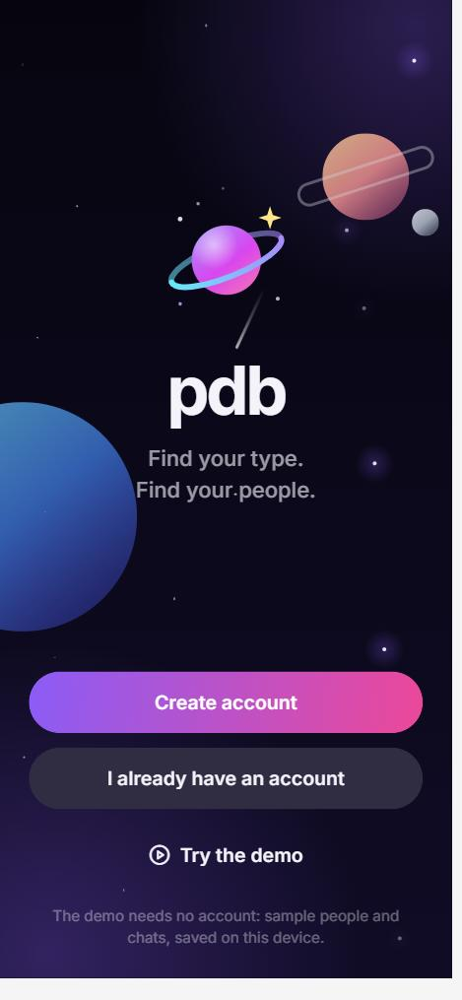
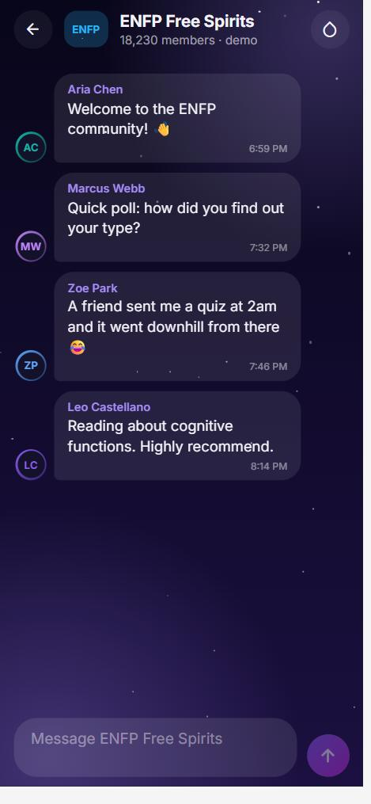
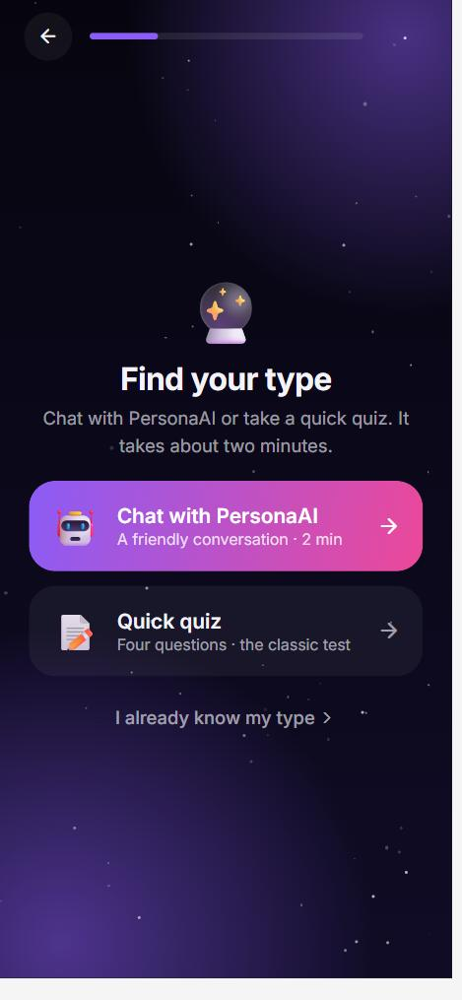
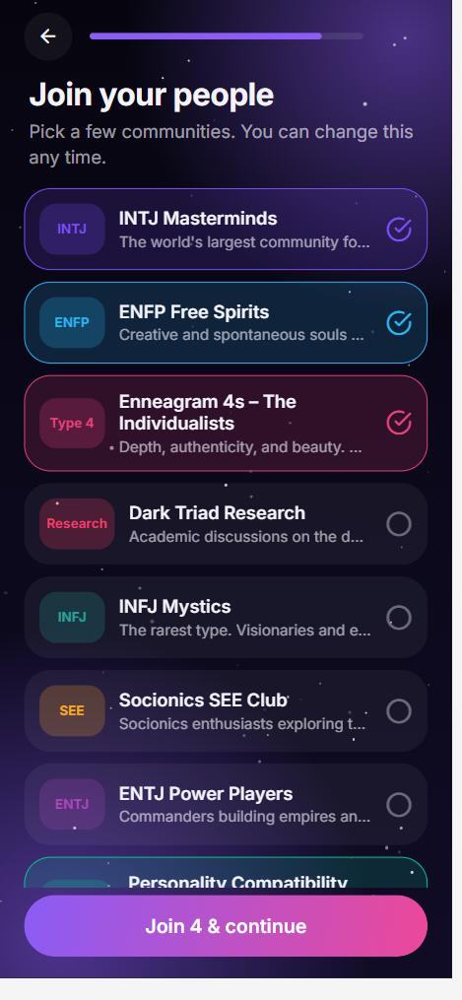
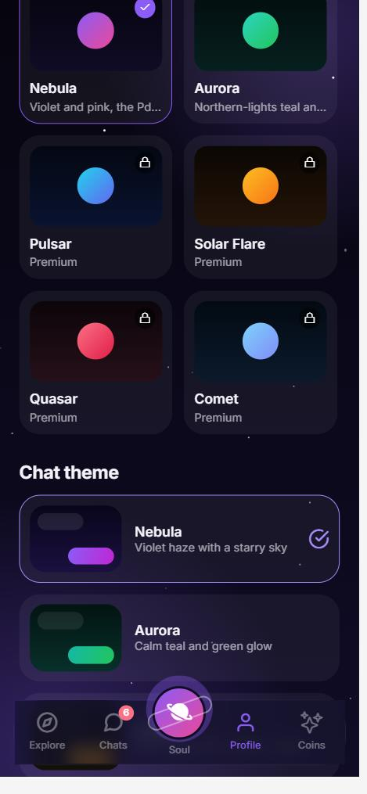

<div align="center">

# Pdb

**A personality-type social app: find your type, join communities, and chat with people who think like you.**

[**Live demo**](https://himanshu-moderator.github.io/Soul-Chemistry-Hub/) · [Screens](#screens) · [Features](#features) · [Backend](#backend) · [Run it locally](#run-it-locally)


</div>

<p align="center">
  
  
  
  
  
</p>

<p align="center">
  
  
  
  
  
</p>

> **Try it without signing up.** Tap **Try the demo** on the welcome screen. You get the whole app with sample people and chats, saved on your device only. **Create account** gives you a real profile stored in the backend, and real chat with other members in the communities.

## What it is

Personality-type communities (MBTI, Enneagram, Socionics) are large and passionate, but the apps around them are scattered across quizzes, wikis and group chats. Pdb puts them in one place:

1. **Sign up** (or try the demo) and set up a profile.
2. **Find your type** with the classic questionnaire (32+ statements) or a real conversation with PersonaAI, or pick it if you already know it.
3. **Join communities** for your type and others, and talk in them live.
4. **Explore** famous people and what their types are.
5. **See your chemistry** with other types, and keep coming back with a daily check-in, coins and themes.

## Screens

| Tab | What you get |
| --- | --- |
| **Explore** | Search and browse famous personalities with their MBTI and Enneagram, follow them, filter by trending or type, and answer a daily question for coins |
| **Chats** | A switch at the top flips between **Chats**, **Requests** (received and sent) and **Communities**. Open a community to talk with its members in real time |
| **Soul** | A deck of people: full-screen photo, scroll for their chemistry with you, interests and idols. Floating buttons pass, message (3 messages until they accept, or a coin Superchat) or like. Tap a profile picture for their full page |
| **Profile** | Your page like everyone else's (cover, photos, card, idols), Edit Profile, level and streak, badges you earn, an AI insights chat, and the app and chat theme pickers |
| **Coins** | Coin packs, daily rewards that follow your streak, a 14-day free trial and premium perks |

## Features

- **Real accounts**: email and password sign-up and sign-in, confirmation emails, password reset, clear error messages, and a session that survives reloads.
- **A proper onboarding**: profile basics (name, unique @username, bio), then finding your type, then picking communities to join.
- **Try the demo** with no account: everything works with sample data saved on the device, and "Exit demo" clears it.
- **Live community chat** (accounts): join a community and talk with its other members. Messages arrive in real time, you can only read and post in rooms you have joined, and posting is rate-limited.
- **Two ways to find your type**: a classic-style questionnaire (32 statements, up to 40 when an axis is close, scored on the four Jungian scales) and PersonaAI, a real conversation with a language model that asks a few open questions and names your type only when it is confident.
- **Soul deck and requests**: likes and first messages become requests; strangers get three messages until they accept; Superchat spends coins to skip the wait.
- **Everything follows your type**: Explore tiles, chemistry pairings, the Big Five sketch and the insights chat change with your type.
- **Server-enforced economy** (accounts): coins, streaks, XP and premium can't be edited from the client. The daily check-in, the trial and (demo) coin packs are database functions.
- **Themes**: six app themes and three chat themes, saved to your account.
- **One codebase** for iOS, Android and web, shown as a phone-sized column on desktop.

### How the AI works

PersonaAI (the onboarding interview and the Profile "Insights" chat) is a **real language model** reached through `src/services/ai`: a Supabase Edge Function holding a free Gemini key (best), a restricted Gemini key in the web build, or free keyless endpoints as a safety net. The interview rules and the code that decides when it may finish are in `src/lib/persona`. Setup, with the steps you do yourself, is in [`docs/AI.md`](docs/AI.md). The classic questionnaire is an original MBTI-style test, not the official MBTI instrument. The 1:1 chats with sample people are scripted; real conversations happen in communities.

## Design

A space theme end to end: a living night sky (twinkling and drifting stars, floating planets, the odd shooting star) behind a clean, borderless UI with soft surfaces, generous spacing and gradient accents.

- **Logo and splash**: a ringed-planet mark ([`docs/BRANDING.md`](docs/BRANDING.md)) and an animated launch screen where the logo blooms out of the star field.
- **Six app themes**: *Nebula* and *Aurora* are free; *Pulsar*, *Solar Flare*, *Quasar* and *Comet* unlock with Premium. Switching re-colours the whole app instantly.
- **Three chat themes** that style every conversation and room: *Nebula* (violet haze, starry sky), *Aurora* (calm teal and green) and *Eclipse* (near-black with a golden edge). Pick one from the droplet button in any chat or from Profile → Themes.
- **A small design system** (`src/components/ui`, `src/theme`): buttons, cards, chips, sheets and text fields that every screen shares, so the look stays consistent.

## Backend

Supabase (Postgres, Auth, Realtime, Edge Functions, Vault). The schema lives in [`supabase/migrations/`](supabase/migrations), starting with [`20261007000000_pdb_schema.sql`](supabase/migrations/20261007000000_pdb_schema.sql). The live demo is wired to a hosted Supabase project, and PersonaAI runs through the `persona-ai` edge function, which keeps the Gemini key in Vault so it never reaches the browser.

| Table | Purpose |
| --- | --- |
| `profiles` | One row per account: name, unique username, bio, types, theme, coins, streak, premium. Clients can only edit the profile fields; the economy columns are locked |
| `follows` | Which famous people you follow |
| `community_members` | Which communities you have joined |
| `community_messages` | Chat messages. Readable and writable only by members of that room |

Row Level Security is on for every table, and the app only ever uses the public anon key.

### Set up your own backend

1. Create a free project at [supabase.com](https://supabase.com).
2. Open **SQL Editor**, paste the contents of the migration file and run it.
3. In **Authentication → Sign In / Providers → Email**, choose whether to require email confirmation (turning it off makes trying the app quicker).
4. In **Authentication → URL Configuration**, set the Site URL to where you host the app.
5. Copy `artifacts/mobile/.env.example` to `artifacts/mobile/.env` and fill in the project URL and anon key (Project Settings → API).
6. Run the rest of the files in `supabase/migrations/` in order (Superchat, hardening and the Vault key getter), then deploy the `persona-ai` edge function and store your Gemini key: see [`docs/AI.md`](docs/AI.md).

Without these values the app still works: it shows the demo only.

## Tech stack

| | |
| --- | --- |
| App | Expo SDK 54, React Native 0.81, Expo Router (file-based routing), React Compiler |
| Language | TypeScript (strict, zero type errors) |
| Backend | Supabase: Postgres with Row Level Security, Auth, Realtime |
| State | React Context; demo data in AsyncStorage (`localStorage` on web) |
| UI | Custom glassmorphism components, Reanimated, Expo Blur, Haptics |
| Monorepo | pnpm workspace (mobile app, an Express API stub, a Vite component sandbox) |

## Run it locally

You need Node 20+ and pnpm.

```bash
pnpm install
cd artifacts/mobile
npx expo start --web      # web, http://localhost:8081
npx expo start            # scan the QR code with Expo Go for a phone
```

> On Windows and macOS the first `pnpm install` is slow: the workspace was set up on Linux, so esbuild falls back to downloading its own binary. It works, it just takes a while.

Type-check with `pnpm run typecheck` from the repo root.

## Deploy the web build

The web app exports to static files and can be hosted anywhere. For a GitHub Pages project site, tell Expo the sub-path (and have your `.env` filled in so accounts work):

```bash
cd artifacts/mobile
EXPO_BASE_URL=/Soul-Chemistry-Hub pnpm run export:web
```

The `dist/` folder is the site. Add a `.nojekyll` file (Pages ignores `_expo` otherwise) and copy `index.html` to `404.html` so deep links work.

## Project structure

```
artifacts/mobile/src/
  app/          routes only (one tiny file per URL)
  features/     one folder per screen: welcome, auth, onboarding, explore, chats, community, soul, profile, coins
  components/   shared pieces: ui, chat, cosmic (the shared sky + splash), brand (logo), navigation
  theme/        design tokens, app themes, chat themes
  state/        sign-in state and app data
  services/     the backend client and the AI service (providers + fallbacks)
  lib/          pure logic: mbti questionnaire, persona prompts and rules, helpers
  data/         sample people, communities and per-type notes
supabase/       database schema and the persona-ai edge function
docs/           architecture, AI setup, branding, screenshots
```

The full map, plus a "where do I change X?" table, is in [`docs/ARCHITECTURE.md`](docs/ARCHITECTURE.md).

## Roadmap

- [x] A real language model behind PersonaAI (edge function proxy)
- [ ] Direct messages between real members, and people discovery
- [ ] Google sign-in
- [ ] Enneagram and Socionics finders, not just MBTI
- [ ] Real purchases for coins and premium
- [ ] Push notifications for new messages

## About

Built by [Himanshu](https://github.com/Himanshu-moderator) as a product prototype. People, celebrity types and the coin shop are sample data for the demo. Pdb is not affiliated with any personality-typing organisation.
